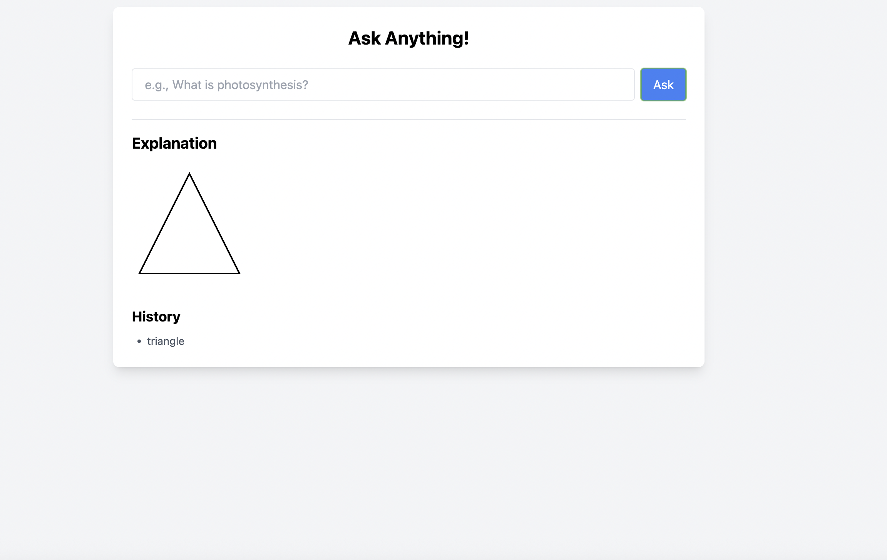
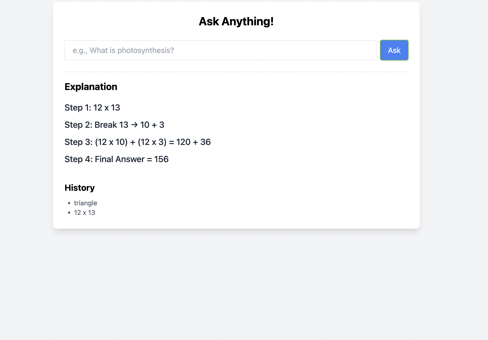
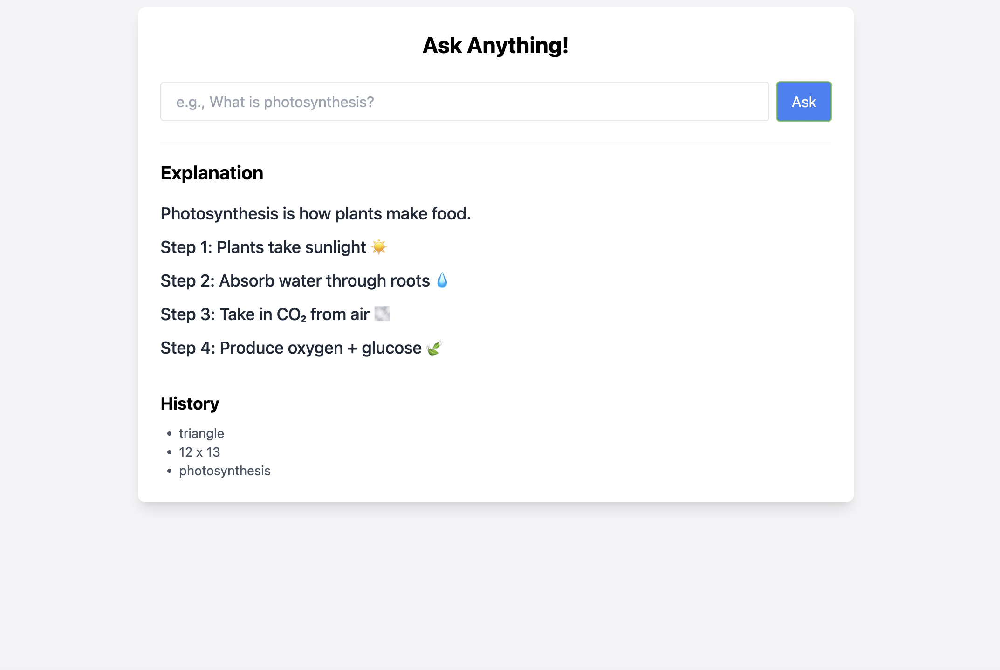

# 🧠 Smart Explanation Board

An interactive, animated explanation app for basic educational questions. Built with **React**, **Framer Motion**, and **creativity** in mind.

---

## 🚀 Features

- 💬 Ask questions like:
  - “What is a triangle?”
  - “What is 12 x 13?”
  - “What is photosynthesis?”
- ✨ Animated explanations using SVGs and text transitions
- 🔁 Replay animation button
- 🕘 History panel
- 📱 Mobile responsive
- ♿ Accessible (screen reader-friendly labels)

---

## 🎨 Creative Touches

- 🧑‍🏫 Blackboard-style layout
- 🔄 Replayable visual steps
- 🌀 Smooth, engaging transitions
- 🧼 Minimalistic, clean UI

---

## ⚠️ Limitations

- 📄 Explanations are **hardcoded** to showcase creative UX only
- 🧠 No dynamic NLP or backend integration (by design – for demo purposes)

---

## 📸 Screenshots

| Triangle Animation | Multiplication Steps | Photosynthesis |
|--------------------|----------------------|----------------|
|  |  |  |

---

## 🛠️ Tech Stack

- React.js
- javascript
- Tailwind CSS
- Framer Motion
